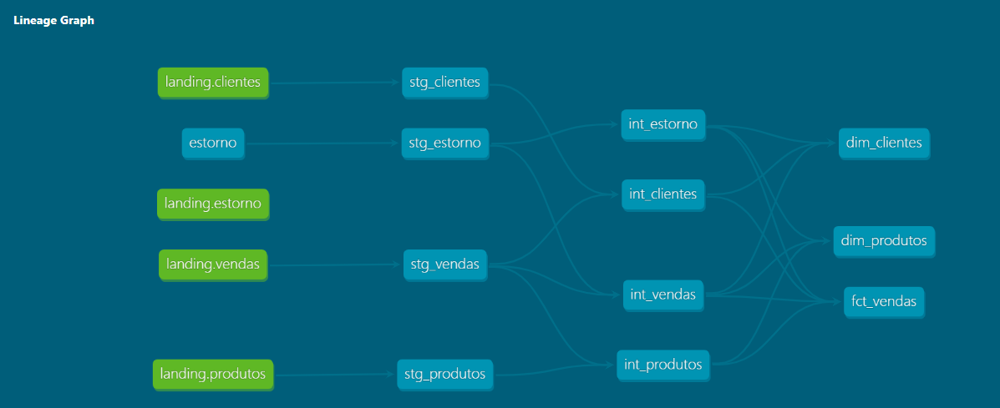

# 🛒 Projeto ShoesBR - Engenharia de Dados com dbt

## Visão Geral

Este projeto tem como objetivo construir uma pipeline de transformação de dados para um e-commerce fictício de calçados (**ShoesBR**), utilizando **dbt (Data Build Tool)** com PostgreSQL hospedado na AWS (RDS).

A arquitetura segue boas práticas modernas de engenharia de dados.
A solução simula um cenário real de engenharia de dados em cloud, com foco em:

Arquitetura em camadas (ELT)
Qualidade e validação de dados
Modelagem relacional
Integração com ferramentas de visualização
Boas práticas utilizadas no mercado

---

### Infraestrutura (Cloud)

O banco de dados está hospedado na:

- AWS RDS (Amazon Relational Database Service)
- Engine: PostgreSQL

> Acesso remoto via endpoint e VPC configurado.


## Arquitetura do Projeto

O projeto está estruturado em camadas:

### 🔹 **Landing (Fonte de dados)**

* Dados brutos armazenados no banco PostgreSQL (RDS)
* Sem transformações

*Obs: O landing é o schema base para o projeto.*

> ### source.yml

Esse YAML define sources (fontes de dados brutas) do seu projeto, ou seja, ele descreve de onde os dados vêm antes de qualquer transformação.

Esse arquivo é responsável por:

- Definir origem dos dados
- Criar lineage
- Gerar documentação
- Habilitar testes
- Garantir governança
- Organizar arquitetura


### 🔹 **Camada Staging (`stg_`)**

* Testes e padronização dos dados mínimos.
* Renomeação de colunas
* Tipagem consistente

Modelos:

* `stg_clientes`
* `stg_produtos`
* `stg_vendas`
* `stg_estorno`

---

## 🗂️ Estrutura de Diretórios:

```
shoesbr/
│
├── analyses/
│   ├── analises_clientes.py
│   ├── analises_produtos.py
│   └── analises_receita.py
│
├── assets/
│   └── charts/
│       ├── top_clientes_total_gasto.png
│       ├── top_produtos_faturamento.png
│       └── top5_receita_liquida_produto_pagamento.png
├── docs/
|     └── models/
|           └── generate_schema_name.md
|           └── homepage.md
|           └── lineage_graph.png
|           └── overview.png
|           └── source_yml.png
|           └── dbt_project_yml.png 
|                  
|── models/
│   ├── source.yml
│   ├── staging/
│         ├── stg_clientes.sql
│         ├── stg_produtos.sql
│         ├── stg_vendas.sql
│         ├── stg_estorno.sql
│         └── schema.yml
│   ├── intermediate/
│         ├── int_clientes.sql
│         ├── int_estorno.sql
│         ├── int_produtos.sql
│         ├── int_vendas.sql
│         └── schema.yml
    └── marts/
│         └── finance/
│         |       ├── fct_vendas.sql  
│         |       └── schema.yml
│         └── marketing/
│                └── dim_clientes.sql
│                └── dim_produtos.sql
│                └── schema.yml
├── seeds/
|     └── estorno.csv
├── macros/
│      └── generate_schema_name.sql
|      └── schema.yml
│
├── dbt_project.yml
└── profiles.yml
```
### Linhagem de dados



---

## ⚙️ Tecnologias Utilizadas

* **Python**
* **SQLAlchemy**
* **Pandas**
* **Matplotlib**
* **dotenv**
* **dbt Core**
* **dbt Cloud**
* **PostgreSQL (AWS RDS)**
* **Python (.venv)**
* **Git**
* **DBeaver**

---

### Segurança das Credenciais

As credenciais do banco foram protegidas utilizando variáveis de ambiente.

>O arquivo .env foi adicionado ao .gitignore para impedir o versionamento de informações sensíveis.

### Criação, Visualização e Exploração de Dados

O projeto utiliza o ```DBeaver``` como ferramenta para:

- Gerenciar o banco de dados: criação de schemas e tabelas de forma visual.
- Explorar dados: navegar pelos schemas landing, staging, intermediate e marts para entender a arquitetura e o conteúdo das tabelas.
- Visualizar tabelas no banco
- Executar queries SQL
- Validar dados após transformações
- Explorar schemas (landing, staging, etc.)

> O scripts-SQL é a pasta onde encontra a sintaxe para criação do banco de dados, schemas, tabelas e insert de dados.

### Exemplo de uso:

> Copie e cole os scripts separados e execute-os no DBeaver manualmente:

```sql
-- Cria o schema landing se não existir
CREATE SCHEMA IF NOT EXISTS landing;

-- Cria a tabela clientes dentro do schema landing
CREATE TABLE landing.clientes (
    customer_id INT PRIMARY KEY,
    name VARCHAR(255),
    address TEXT,
    phone VARCHAR(50),
    email VARCHAR(100)
);

-- Insere os dados na tabela
INSERT INTO landing.clientes (customer_id, name, address, phone, email) VALUES
(1, 'Barbara Pinto', 'Campo de Monteiro
Vila Suzana Segunda Secao
08252-397 Barros Grande ', '+55 (071) 0771 6705', 'vargasalicia@example.net')
```

Depois de criada as tabelas rode: ```dbt run```

## Fontes de Dados (Sources)

As fontes são declaradas no dbt via ```source.yml```, permitindo rastreabilidade, documentação automática e testes de integridade. Os dados são organizados no schema `landing`, com as seguintes tabelas:

* `clientes`
* `produtos`
* `vendas`
* `estorno`

> O ```schema```, ```tables``` e os dados foram incluidos via SQL na camada ```staging```.

---

## Testes de Qualidade de Dados

O projeto utiliza testes nativos do dbt para garantir integridade:

### Testes aplicados:

* `unique` → garante unicidade (PK)
* `not_null` → evita valores nulos
* `relationships` → valida integridade referencial (FK)
* `accepted_values` → valida domínio de valores

### Exemplo:

```yaml
- name: customer_id
  tests:
    - not_null
    - relationships:
        arguments:
          to: ref('stg_clientes')
          field: customer_id
```

---

## Execução do Projeto

### Rodar modelos:

```bash
dbt build --select staging (ou intermediate ou marts)
```

### Rodar testes:

```bash
dbt test
```

### Debug de conexão:

```bash
dbt debug
```

---

## Sobre Deprecações no dbt:

Durante o desenvolvimento, foram identificados warnings de depreciação como:

```
MissingArgumentsPropertyInGenericTestDeprecation
```

> O dbt está **evoluindo sua sintaxe**, especialmente na definição de testes.

### Forma antiga (ainda funciona, mas será removida):

```yaml
- relationships:
    to: ref('tabela')
    field: id
```

### Nova forma recomendada:

```yaml
- relationships:
    arguments:
      to: ref('tabela')
      field: id
```

> Esse padrão será obrigatório em versões futuras.

---

## Boas Práticas Aplicadas:

* Separação por camadas (staging / intermediate / marts)
* Padronização de nomenclatura (`stg_`)
* Testes de qualidade desde o início
* Uso de `ref()` para dependências
* Evitar duplicação de colunas em YAML
* Uso de macros para controle de schema, quando necessário.
* Uso de `source()`.	Sempre referencie dados brutos com source('fonte', 'tabela')
* Documentação dos modelos	

> *Sem regras de negócio. As regras complexas ficam para as camadas intermediate ou marts.*

---

### Seeds: Dados de Estorno

O projeto utiliza um arquivo CSV como fonte de dados para estornos, localizado na pasta `seeds/.` no dbt.

O arquivo simula dados de reembolso de pedidos e contém as seguintes colunas:

- **purchase_id**: Identificador único da compra
- **customer_id**: Identificador do cliente
- **product_id**: Identificador do produto
- **refund_date**: Data do estorno
- **refund_reason**: Motivo do estorno
- **refund_amount**: Valor reembolsado

> Ambos documentados em `source.yml`

### Carga de Dados com dbt Seed

> Para carregar os dados do CSV para o banco de dados, utilizamos o comando:

> dbt seed

O comando lê os arquivos da pasta `seeds/`, cria tabelas no banco de dados e insere os dados do CSV nessas tabelas.

Por padrão, a tabela será criada com o mesmo nome do arquivo (estorno) no schema configurado no projeto (ex: landing).


### Transformação: Staging de Estornos

Após a carga dos dados, o modelo de staging `stg_estorno` é responsável por:

- Padronizar os tipos de dados
- Renomear colunas (se necessário)
- Garantir consistência para uso nas camadas seguintes

## Camada Intermediate

A camada intermediate tem como objetivo realizar transformações mais complexas, combinando dados das tabelas de staging e preparando-os para consumo na camada analítica (marts).

Nesta etapa, foram aplicadas boas práticas de modelagem com dbt para garantir organização, reutilização e clareza nas transformações.

### 🔹 Prefixo int_ nos modelos

Todos os modelos da camada intermediate seguem o padrão de nomenclatura:

- int_vendas
- int_produtos
- int_clientes
- int_estornos


> Esse padrão facilita a identificação da camada e melhora a organização do projeto.

🔹 Combinação de dados

Foram realizados joins entre diferentes entidades da camada staging para enriquecer os dados:


- **int_vendas**: combinação de vendas com dados de estornos
- **int_estornos**: enriquecimento dos estornos com informações das vendas
- **int_produtos**: agregação de vendas por produto
- **int_clientes**: agregação de compras por cliente

### 🔹 Criação de entidades derivadas

Foram criadas entidades intermediárias com valor analítico, como:

- Vendas enriquecidas com informações de estorno
- Produtos com métricas agregadas (total vendido e faturamento)
- Clientes com comportamento de compra (total gasto e quantidade de compras)
- Estornos com contexto de venda (valor, produto e cliente associados)

🔹 Separação de responsabilidades

Cada modelo possui uma responsabilidade única:

- int_vendas → consolidação de vendas + estornos
- int_produtos → métricas por produto
- int_clientes → métricas por cliente
- int_estornos → análise detalhada de estornos

> Isso garante maior clareza, manutenção simplificada e menor acoplamento entre transformações.


### 📊 Camada Marts 

A camada marts representa o nível final de modelagem dentro do projeto dbt, sendo responsável por disponibilizar dados prontos para consumo pelo negócio. Os modelos dessa camada são estruturados para atender diretamente analistas, dashboards e ferramentas de BI, contendo métricas, agregações e KPIs finais.

> **Estrutura**

A organização segue separação por domínio de negócio:

```
marts/
  finance/
    fct_vendas.sql
  marketing/
    dim_clientes.sql
    dim_produtos.sql
```

### 🔹 Prefixos


| Tipo |	Prefixo	| Descrição |
| --| -- | -- |
| Fato |	fct_ | Tabelas com métricas e eventos
|Dimensão|	dim_	| Tabelas descritivas
Relatórios|	report_	| (não utilizado ainda)

### 🔹 KPIs e Métricas

A camada marts concentra cálculos finais de negócio, como:

- Receita líquida = (receita_liquida)
- Total gasto por cliente = (total_gasto)
- Total de compras =  (total_compras)
- Diversidade de produtos =  (diversidade_produtos)
- Total faturado =  (total_faturado)
- Total estornado = (total_estornado)

### 🔹 Organização por domínio

Os modelos estão separados por áreas de negócio:

- Finance → métricas de vendas
- Marketing → comportamento de clientes e produtos.


> Melhora escalabilidade e organização do projeto.

---

## Gráficos Implementados
### 📈 Top 10 Clientes por Total Gasto

O gráfico apresenta os clientes com maior volume financeiro no e-commerce.


### 📦 Top 10 Produtos por Total Faturado

Visualização dos produtos com maior faturamento total.


### 💳 Top 5 Receita Líquida por Produto e Método de Pagamento

Análise cruzando:

Produto
Método de pagamento
Receita líquida


## 💡 Aprendizados

- Implementação de arquitetura ELT com dbt
- Uso de testes para qualidade de dados
- Modelagem em camadas
- Integração com PostgreSQL em Cloud (AWS RDS)

---

## 📊 Objetivo do Projeto

Este projeto foi desenvolvido com foco em aprendizado prático de:

* Engenharia de dados moderna
* Transformações com dbt
* Modelagem analítica
* Qualidade de dados

---

---

# 📦 Histórico de Releases

O projeto **ShoesBR** segue um processo contínuo de evolução, versionamento e melhorias na arquitetura de dados.

| Release | Descrição |
|---|---|
| `v1.0.0` | Estrutura inicial do projeto dbt, modelagem analítica, documentação e integração com GitHub |
| `v1.1.0` | Implementação da orquestração automatizada com dbt Cloud, execução de jobs, testes e geração automática de documentação |

---

## 🚀 Evolução do Projeto

Cada release representa uma nova etapa de maturidade do pipeline de dados, incluindo melhorias em:

- Arquitetura analítica
- Automação
- Qualidade dos dados
- Documentação
- Versionamento
- Governança
- Orquestração

O objetivo do projeto é simular um ambiente real de Engenharia de Dados e Analytics Engineering utilizando boas práticas de mercado.

## 👨‍💻 Autor

Projeto desenvolvido por **Daniel M.F.**

---

